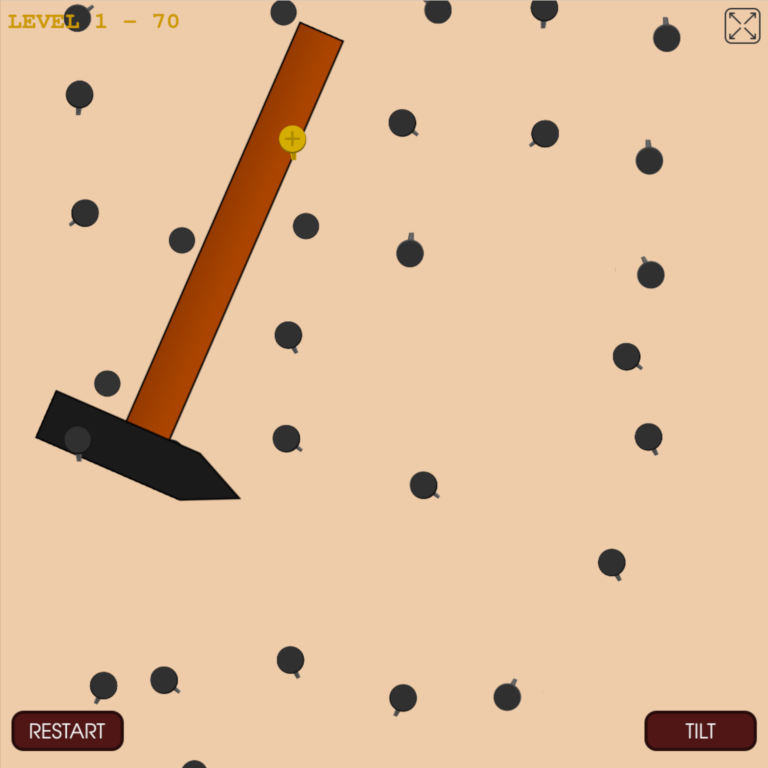

**All you have is a hammer** is a tiny browser game in which it is your job to
drop a hammer through a field of nails by knocking in the nails one by one.

But beware! Since all you have is a hammer, some things that look like nails are
not actually nails, and won't be so easy to deal with (they're screws. Screws is
what the things that aren't nails are).

**All you have is a hammer** was created for [Game Off 2022](https://itch.io/jam/game-off-2022),
a game jam with the theme **“cliché”**.

## Play the game

 * [On its homepage](https://tjol.eu/hammer-game/)
 * [On itch.io](https://tjol.itch.io/all-you-have-is-a-hammer)

